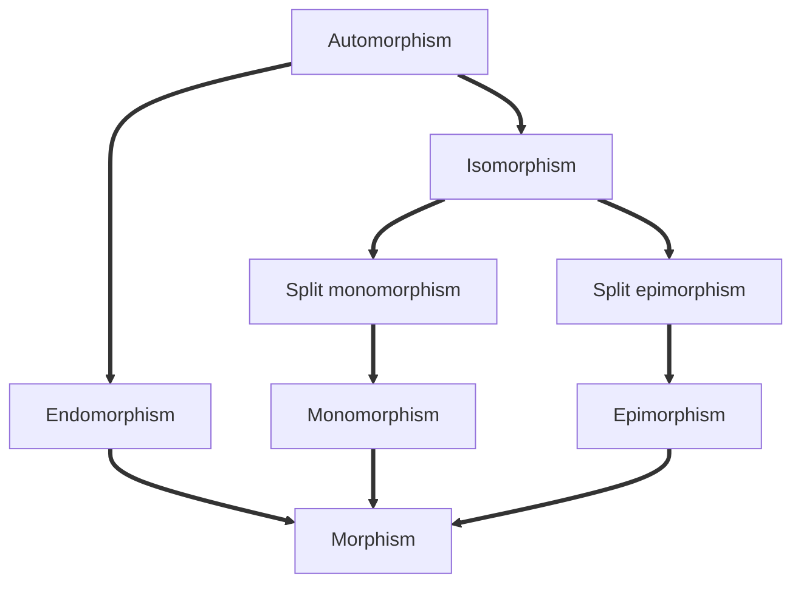

---
tags:
  - public
---
[[Category]]
# Morphism

A **morphism** is an element of some [[category]]. #m/def/cat 
Typically, it represents some kind of structure-preserving map between sets,
or a more abstract relationship between objects.
Morphisms have the important property that they may be composed to produce new morphisms.

## Classification

In the following, arrows signify implication.

The same prefixes are used for specific morphisms, including [[Functor|functors]] and [[Natural transformation|natural transformations]].

Mnemonic for types of morphism
→
`MILESR`
- **M**onic
- **I**njective
- **L**eft-cancellable 
- **E**pic
- **S**urjective
- **R**ight-cancellable
<!--SR:!2024-02-25,210,190-->

#
---
#state/tidy | #to/simplify | #flashcards/maths/mnemonic 