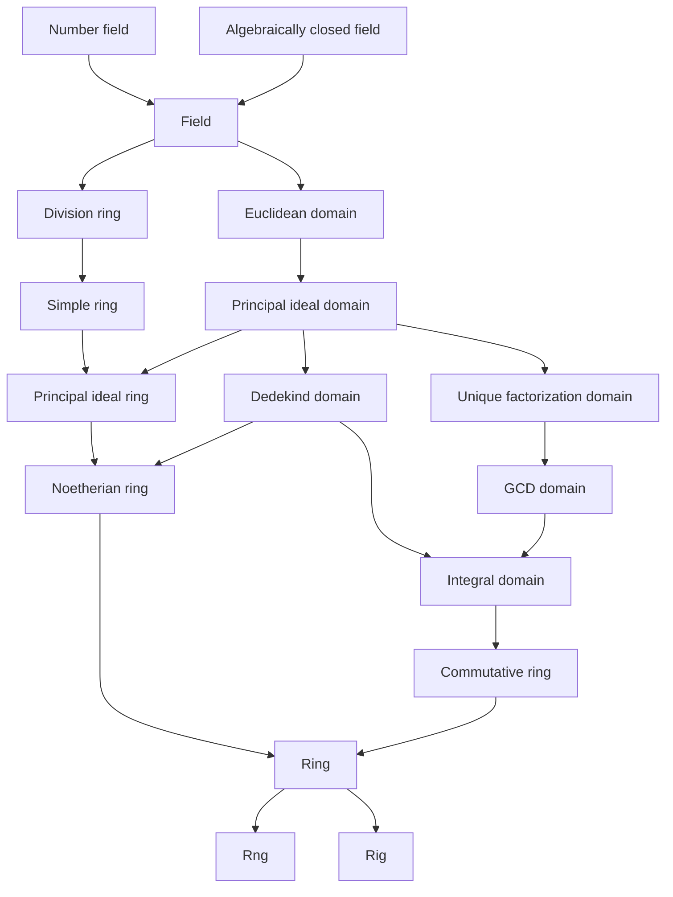

---
tags:
  - public
alias:
  - "#m/def/ring"
  - "#m/thm/ring"
---
[[Abstract algebra MOC]]
# Ring theory MOC

[[Category of rings]]

## Objects

The graph below is a non-exhaustive classification of rings

### Examples

- [[Modular arithmetic]]

## Morphisms

- [[Rng homomorphism]], [[Ring homomorphism]]

## Internally

- [[Characteristic]]
- [[Krull dimension]]

### Elements

- [[Unit]], [[Zero-divisor]]
- [[Irreducible element]], [[Prime element]], [[Associate elements]]
- [[Algebraic element]], [[Integral element]]

## Externally

- [[Subrng]], [[Subring]], [[Field extension]]
- [[Ideal]], [[Quotient ring]]

## Related

- [[Module theory MOC]]

#
---
#MOC | #state/develop | #lang/en | #SemBr