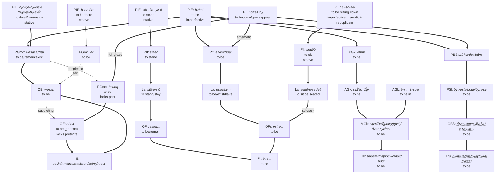

---
tags:
  - public
---
[[Proto-Indo-European MOC]]
# The development of ”to be” in Indo-European languages

```mermaid
graph TD;
En_be["En: <em class='ling'>be/is/am/are/was/were/being/been</em>"]
OE_bēon["OE: <em class='ling'>bēon</em>\nto be (gnomic)\nlacks preterite"]
OE_bēon==>En_be
OE_wesan["OE: <em class='ling'>wesan</em>\nto be"]
OE_wesan==>En_be
OE_wesan-->|suppleting|OE_bēon
PGmc_beuną["PGmc: <em class='recon'>beuną</em>\nto be\nlacks past"]
PGmc_beuną==>OE_bēon
PGmc_wesaną["PGmc: <em class='recon'>wesaną/*isti</em>\nto be/remain/exist"]
PGmc_wesaną==>OE_wesan
PGmc_wesaną-->|suppleting|PGmc_beuną
PIE_Hésti["PIE: <em class='recon'>h₁ésti</em>\nto be\nimperfective"]
PIE_Hésti==>PGmc_wesaną
PIE_Hwes["PIE: <em class='recon'>h₂(w)e-h₂wós-e ~ *h₂(w)e-h₂us-ḗr</em>\nto dwell/live/reside\nstative"]
PIE_Hwes==>PGmc_wesaną
PIE_bʰuH["PIE: <em class='recon'>bʰ(e)uh₂</em>\nto become/grow/appear"]
PIE_bʰuH==>|full grade|PGmc_beuną

PGmc_ar["PGmc: <em class='recon'>ar</em>\nto be"]
PGmc_ar-->|eart|OE_wesan
PIE_HeHóre["PIE: <em class='recon'>h₂eh₂óre</em>\nto be there\nstative"]
PIE_HeHóre-->PGmc_ar

Fr_être["Fr: <em class='ling'>être...</em>\nto be"]
OFr_ester["OFr: <em class='ling'>ester...</em>\nto be/remain"]
OFr_ester==>Fr_être
OFr_estre==>Fr_être
OFr_estre["OFr: <em class='ling'>estre...</em>\nto be"]
La_stāre["La: <em class='ling'>stāre/stō</em>\nto stand/stay"]
La_stāre==>OFr_ester
La_esse["La: <em class='ling'>esse/sum</em>\nto be/exist/have"]
La_esse==>OFr_estre
La_sedēre["La: <em class='ling'>sedēre/sedeō</em>\nto sit/be seated"]
La_sedēre==>|soi-/ser-|OFr_estre
PIt_staēō["PIt: <em class='recon'>staēō</em>\nto stand"]
PIt_staēō==>La_stāre
PIE_stHéHyeti["PIE: <em class='recon'>sth₂-éh₁-ye-ti</em>\nto stand\nstative"]
PIE_stHéHyeti==>PIt_staēō
PIt_ezom["PIt: <em class='recon'>ezom/*fūai</em>\nto be"]
PIt_ezom==>La_esse
PIE_Hésti==>PIt_ezom
PIE_bʰuH==>|athematic|PIt_ezom
PIt_sedēō["PIt: <em class='recon'>sedēō</em>\nto sit\nstative"]
PIt_sedēō==>La_sedēre
PIE_sísdeti["PIE: <em class='recon'>sí-sd-e-ti</em>\nto be sitting down\nimperfective thematic i-reduplicate"]
PIE_sísdeti==>PIt_sedēō

Gk_eímai["Gk: <em class='ling'>είμαι/είναι/ήμουν/όντας/είσαι</em>\nto be"]
MGk_eîmai["MGk: <em class='ling'>εἶμαι/ἔνι/ἦμου(ν)(α/ε)/ὄντα(ς)/εἶσαι</em>\nto be"]
MGk_eîmai==>Gk_eímai
AGk_eimí["AGk: <em class='ling'>εἰμῐ́/ἐστί/ἦν</em>\nto be"]
AGk_eimí==>MGk_eîmai
PGk_ehmi["PGk: <em class='recon'>ehmi</em>\nto be"]
PGk_ehmi==>AGk_eimí
PIE_Hésti==>PGk_ehmi
AGk_éni["AGk: <em class='ling'>ἔνι</em> ← <em class='ling'>ἔνεστι</em>\nto be in"]
AGk_éni==>MGk_eîmai

Ru_byt'["Ru: <em><abbr class='ling' title='inf/present sg/future 1sg/m past/active present part.'>бы́ть/есть/бу́ду/бы́л/су́щий</abbr></em>\nto be"]
OES_byti["OES: <em><abbr class='ling' title='inf/present 3sg/future 1sg/resultative/active present part.'>бꙑти/есть/бѫдѫ/бꙑлъ/сꙑ</abbr></em>\nto be"]
OES_byti==>Ru_byt'
PSl_bỳti["PSl: <em class='recon'>bỳti/estь/bǫdǫ/bylъ/sy</em>\nto be"]
PSl_bỳti==>OES_byti
PBS_butei["PBS: <em class='recon'>bū́ˀtei/ésti/sánti<em>"]
PBS_butei==>PSl_bỳti
PIE_Hésti==>PBS_butei
PIE_bʰuH==>PBS_butei
```

#
---
#state/develop | #lang/en | #SemBr
