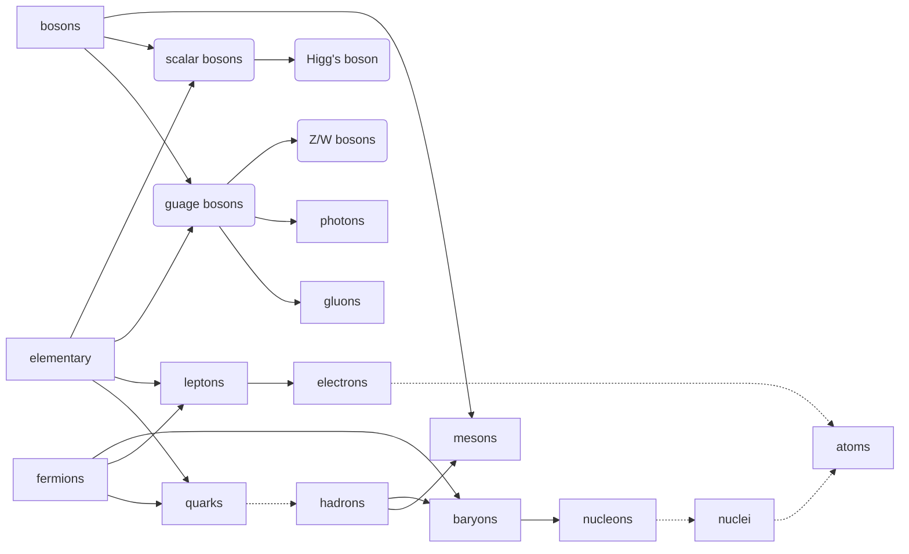

[[Particle physics MOC]]
# Classification of particles under the Standard Model

- **Elementary particles** — 
  The smallest, indivisible units of stuff,
  as far as the standard model is concerned.
  They are subdivided into the following:
  - [[Quarks]] in three generations
  - [[Leptons]] in three generations
  - [[Gauge bosons]] are elementary bosons that act as “force”[^int] carriers for elementary fermions, see [[Fundamental interactions]]
  - One fundamental [[Scalar boson]]
- **Fermions and Bosons** — 
  All particles, both elementary and composite, are one of the following.
  Notably, atoms may be either, depending on their composition.
  - **Fermions** have half-integer spin and follow [[Fermi-Dirac statistics]].
    Notably, they obey the [[Pauli exclusion principle]],
    meaning two fermions cannot have the same quantum state.
  - **Bosons** have integer spin and follow [[Bose-Einstein statistics]].
    They do not follow the [[Pauli exclusion principle]],
    so an unlimited number of bosons can have the same quantum state.
- **Hadrons** —
  [[Quarks]] do not exist on their own,
  rather only in composite [[Matter and bound states|bound-states]].
  - **Baryons** are fermionic hadrons,
    notably including nucleons (protons and neutrons).
  - **Mesons** are bosonic hadrons.

[^int]: The word “interaction” may be preferred, since a classical force is not always present during an interaction.
  

#
---
#state/tidy | #SemBr
