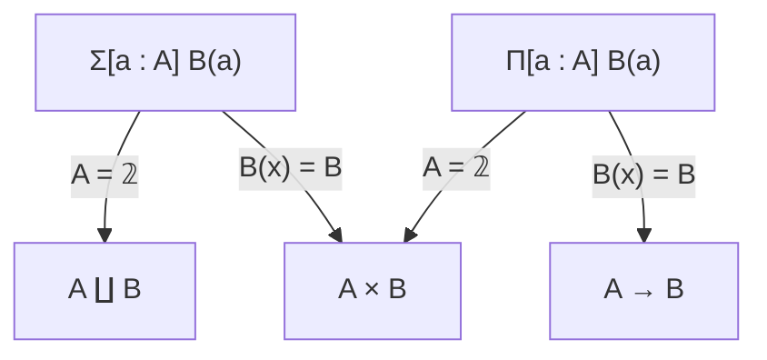

---
tags:
  - public
aliases:
  - "#m/def/type"
  - "#m/thm/type"
---
[[Mathematics MOC]]
# Type theory MOC

**Type theory** is the study of [[Type theory|type theories]] and their semantics.
The differences between type theory and [[Set theory MOC|set theory]] are subtle; see [[Type theory#Type theory vs set theory]].

## Axiomatic type theories

[[Calculus of substitutions]]

### à la Church

- [[Lambda cube]]
  - [[Simply typed λ-calculus]]

### à la Martin-Löf

- [[ETT]]
- [[ITT]]
- [[Homotopy type theory]]
    - [[Axiomatic HoTT]]
    - [[Cubical TT]]

## Connectives

- [[Empty type]]
- [[Unit type]]
- [[Natural numbers type]]
- [[Type of booleans]]

### Type constructors

- [[Π-type]] ([[Function type]])
- [[Σ-type]] ([[Product type]])
- [[Coproduct type]]
- [[Identity type]]
    - [[Extensional equality type]]

### Special kinds of types

- [[Inductive type]]
    - [[W-type]]
- [[Coïnductive type]]
- [[Higher inductive type]]

## Elements of syntax

- [[Context in a proof system]]
- [[Judgemental equality]]

## Concepts

- [[Internalizing judgemental structure]]

## Computation

- [[β-computation]]
- [[η-unicity]]

## Bibliography

- [[@angiuliPrinciplesDependentType2025|PoDTT]]

#
---
#state/develop | #lang/en | #SemBr
