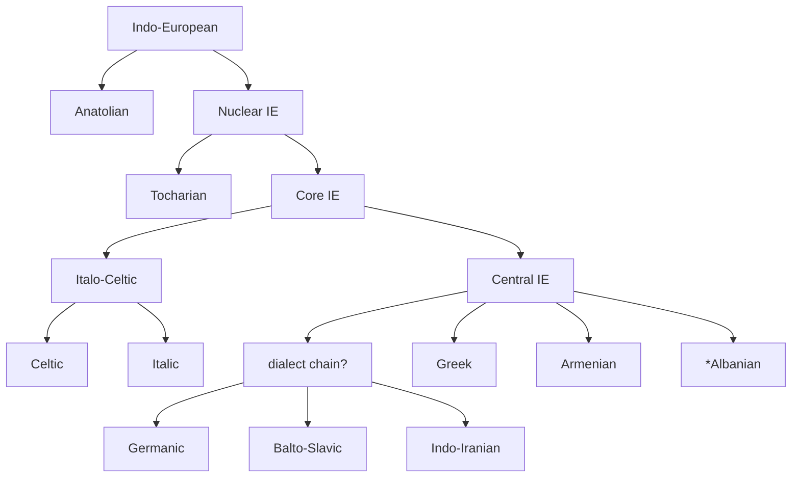

---
aliases:
  - Core IE
  - Nuclear IE
  - Central IE
tags:
  - public
---
[[Proto-Indo-European MOC]]
# A probable cladistic tree of IE

Internal nomenclature and structure from 2017\. [[Sources/@ringeProtoIndoEuropeanProtoGermanic2017|From Proto-Indo-European to Proto-Germanic]].
#
---
#state/tidy | #lang/en | #SemBr
