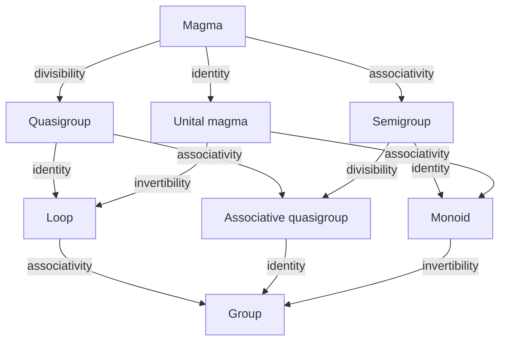

---
tags:
  - public
---
[[Mathematics MOC]]
# Abstract algebra MOC

Abstract algebra begins with the study of algebraic structures on sets:
Sets endowed with some algebraic operations.

## Group like

#
---
#MOC | #state/develop | #lang/en | #SemBr