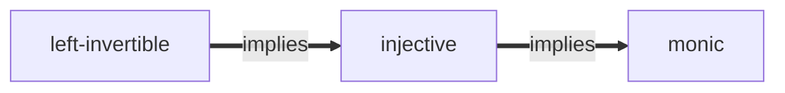

---
aliases:
  - monic
  - mono
tags:
  - public
---
[[Morphism]]
# Monomorphism

A **monomorphism** is a **left-cancellable** morphism (denoted with $\rightarrowtail$).
A morphism $m : Y \to Z$ is **monic** iff for any $X \in \cat C$ and $f, g : X \to Y$ #m/def/cat 
$$
\begin{align*}
m \circ f = m \circ g \implies f = g
\end{align*}
$$
In $\Set$ a function is a monic iff it is injective iff it is left-invertible (i.e. [[Split monomorphism|split monic]]), but these are not equivalent in every [[concrete category]], rather:

## Properties

See the [[Epimorphism#Properties|dual properties]].

1. If $fg$ is monic then $g$ is monic. ^P1

> [!check]- Proof of 1
> Note $ga = gb$ implies $fga = fgb$ which holds iff $a = b$, proving [[#^P1]]. 

#
---
#state/tidy | #lang/en | #SemBr
