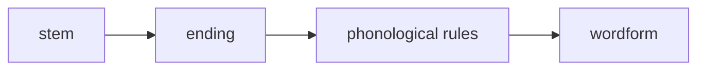

---
aliases:
  - OIcel MOC
tags:
  - public
---
[[Germanic Languages MOC]]
# Old Icelandic MOC

**Old Icelandic** is the most widely attested form of [[Old Norse]].

## Grammar

- [[OIcel phonology]]
- [[OIcel morphology]]
- [[OIcel pronominal inflection]]

## Vocabulary

- [[OIcel noun vocabulary]]
- [[OIcel verb vocabulary]]
- [[OIcel mixed vocabulary]]
- [[OIcel adjective vocabulary]]

## History

- [[Altnordische Zeitliste]]

## Resources

- [Old Norse Dictionary of Prose](https://onp.ku.dk/onp/onp.php)

#
---
#state/develop | #lang/en | #SemBr
