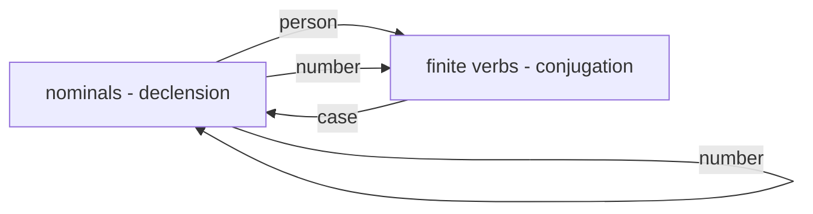

---
tags:
  - public
---
[[Proto-Indo-European MOC]]
# PIE morphology MOC
Prior to the discovery of the Anatolian and Tocharian branches of Indo-European,
the eldest attested daughter languages seemed to agree on a system of inflectional morphology.
Anatolian and to a lesser extent Tocharian did not agree so well with this system,
and a holistic system is yet to be reconstructed
so **[[A probable cladistic tree of IE|Core IE]]** is taken as a starting point for morphological reconstruction.
What little reconstruction has been managed suggests the development of **Proto-Core IE** saw some increase in inflectional complexity with little loss.[^defect]

[^defect]: 2017\. [[Sources/@ringeProtoIndoEuropeanProtoGermanic2017|From Proto-Indo-European to Proto-Germanic]], p. 25 (§2.3)


```txt
root + suffix + ending
\___stem____/        /
 \________word______/
```

## Inflectional morphology

Some features listed here may have derivational origins, but definitely by Core IE had become inflectional in nature.

### Concord classes


- [[PIE case]]
- [[PIE grammatical number]]
- [[PIE grammatical gender]]
- [[PIE person system]]

### Verb morphosyntactic categories

The verb system of PIE changed substantially between PIE and Proto-[[A probable cladistic tree of IE|Core IE]],
which poses more problems for reconstructing the original verb system.

| Feature                | PIE                                                                          | [[A probable cladistic tree of IE\|Core IE]]                                                            |
| ---------------------- | ---------------------------------------------------------------------------- | ------------------------------------------------------------------------------------------------------- |
| [[PIE aspect\|Aspect]] | Derivational system, stems are either inherently imperfective or perfective. | Inflectional system, stems for perfective (“aorist”), imperfective (“present”), and stative (“perfect”) |
| [[PIE mood\|Mood]]     | Indicative (past, present), Imperative                                       | Indicative (past, present), Imperative, Subjunctive, Optative                                           |
| [[PIE voice\|Voice]]   | Active, Mediopassive                                                         | Perfect probably had no mediopassive form                                                               |

PIE also possessed [[PIE participles|participles]], which were adjectives
but could be nominalised to construct a subordinate clause.
These were formed from aspect stems with the addition of a suffix.

### Expression of inflectional categories

- [[PIE declension]] (inflection of nominals)
- [[PIE conjugation]] (inflection of verbs)


#
---
#MOC | #state/develop | #lang/en | #SemBr