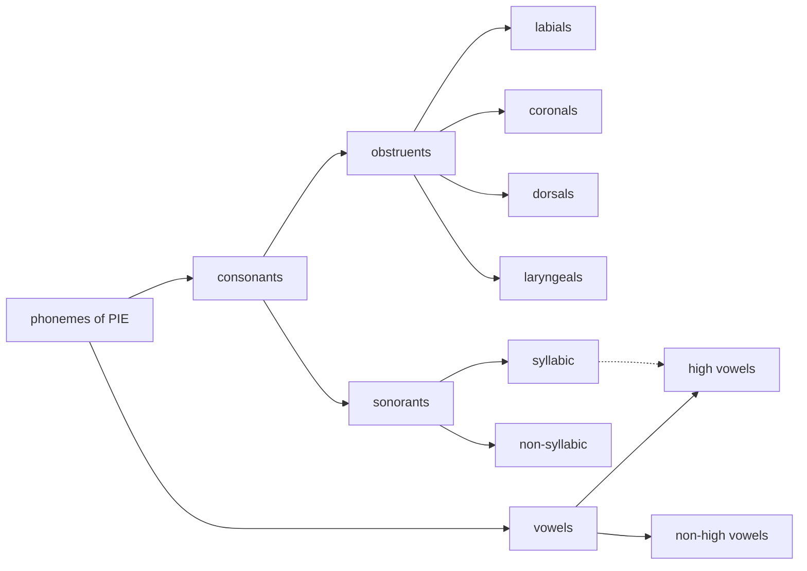

---
tags:
  - public
---
[[Proto-Indo-European MOC]]
# Proto-Indo-European phonology
While the precise phonetics of PIE is not and in all likelihood never will be known[^pot],
a pretty good picture of the variety of phonemes, the relationships therebetween, and the phonotactics is deduced by the [[Comparative method]].

[^pot]: See [[Potential IPA key for PIE]] for a speculation of pronunciation.

An index of phonological rules is below under [[#Rules]].

## Inventory

As well as a variety of phonemes, PIE possessed [[Pitch accent]]

### Obstruents
| bilabial | coronal | palatal | velar | labiovelar | glottal? |
| -------- | ------- | ------- | ----- | ---------- | -------- |
| <em class="recon">p</em>     | <em class="recon">t</em>    | <em class="recon">ḱ</em>    | <em class="recon">k</em>  | <em class="recon">kʷ</em>      |          |
| <em class="recon">b</em>     | <em class="recon">d</em>    | <em class="recon">ǵ</em>    | <em class="recon">g</em>  | <em class="recon">gʷ</em>      |          |
| <em class="recon">bʰ</em>    | <em class="recon">dʰ</em>   | <em class="recon">ǵʰ</em>   | <em class="recon">gʰ</em> | <em class="recon">gʷʰ</em>     |          |
|          | <em class="recon">s</em>    |         | <em class="recon">h₂</em> | <em class="recon">h₃</em>?     | <em class="recon">h₁</em>    |

The obstruents are further grouped with
- **Dorsals** `K` contain the stops in the palatal, velar, and labiovelar columns.
- **Laryngeals** `H` contain the murky <em class="recon">hₓ</em> characters.
  See also [[PIE *e-laryngeal colouring]] and [[PIE laryngeal deletion]].

### Sonorants 
The sonorant class are a distinct feature of PIE,
comprising of apparently underlyingly non-syllabic phonemes
with rule-determined syllabicity (See [[Siever's law]] and [[#Rules]]).
This is in stark contrast to PIE's vowels which were unalterably syllabic,
and its obstruents which were unalterably syllabic.

However, <em class="recon">w</em> and <em class="recon">y</em> behave differently:
in some situations[^exc] their syllabic allophones appear where the rules would dictate they shouldn't,
in which case they must be viewed as distinct phonemes <em class="recon">u</em> and <em class="recon">w</em>.
In many cases it is impossible to tell whether the sonorant or the vowel is present,
so conventionally the vowel symbols are used in all cases.

[^exc]: For <em class="recon">i</em> see <em class="recon">newiós</em> "new", as contrasted to <em class="recon">ályos</em> "other" and <em class="recon">sewyós</em> "left".
  <em class="recon">u</em> is posited to be distinct since it appears in some non-ablauting stems,
  such as <em class="recon">bʰuH-</em>.
  Brief discussion can be found in Ringe, p. 11

| phoneme | non-syllabic allophone | syllabic allophone |
| ------- | ---------------------- | ------------------ |
| \*/y/   | <em class="recon">y</em>                   | <em class="recon">i</em>               |
| \*/w/   | <em class="recon">w</em>                   | <em class="recon">u</em>               |
| \*/r/   | <em class="recon">r</em>                   | <em class="recon">ṛ</em>               |
| \*/l/   | <em class="recon">l</em>                   | <em class="recon">ḷ</em>               |
| \*/m/   | <em class="recon">m</em>                   | <em class="recon">ṃ</em>               |
| \*/n/   | <em class="recon">n</em>                   | <em class="recon">ṇ</em>               | 

### Vowels
Note it is unclear whether vowels could occur word-initially in PIE,
since all word initial <em class="recon">h₁</em> disappeared in all daughter languages.

#### High vowels
See [[#Sonorants|above]].

| short | long |
| ----- | ---- |
| <em class="recon">i</em>  | <em class="recon">ī</em> |
| <em class="recon">u</em>  | <em class="recon">ū</em> |

#### Non-high vowels
The PIE system of non-high vowels follows a system of apophony called [[Ablaut]].

- <em class="recon">ē</em> ~ <em class="recon">e</em> ~ ∅ ~ <em class="recon">o</em> ~ <em class="recon">ō</em>
- <em class="recon">ā</em> ~ <em class="recon">a</em> ~ ∅

where \*/e/ and \*/a/ were the underlying segment in the vast majority of cases.

<em class="recon">e</em> had allophones when adjacent to the second and third laryngeals:
See [[PIE *e-laryngeal colouring]].

### Problems with neutralised contrasts
There existed a number of rules which make it impossible to contrast certain phonemes in specific environments.

- [[PIE *e-laryngeal colouring]] neutralised some non-high vowel distinctions when adjacent to laryngeals.
- [[PIE velar labialisation]] neutralised velar/labiovelar distinction when adjacent to vowels or sonorants that exhibited rounding
- <em class="recon">ss</em> was not distinguished from <em class="recon">s</em>. <em class="recon">dʰegʰem</em>

### Accent
See [[PIE accent]].

## Rules
- [[Ablaut]]

### Mostly productive
- [[PIE laryngeal deletion]]
  - `H -> ø / o[+sonorant]_[-syllabic]`
  - `H -> ø / [+consonant]_y`
  - `H -> ø / CC_C`
  - `H -> ø / [+syllabic]_»`^[Where `»` represents an utterance boundary.]
- [[PIE *e-laryngeal colouring]] (must be short)
  - `e -> a / {_h₂ h₂_}`
  - `e -> o / {_h₃ h₃_}`
- [[PIE vowel lengthening by contraction]]
  - `ee -> ē` &c.
- [[PIE syllabification of sonorants]]
  1. `[+sonorant -syllabic] -> [+sonorant +syllabic] / _{[-syllabic] #}`^[With exceptions]
  2. `[+sonorant -syllabic] -> [+sonorant +syllabic] / {[+vowel +long] [-syllabic]}[-syllabic]_`
  3. `[+sonorant -syllabic] -> [+sonorant +syllabic] / {[+vowel +long] [+vowel][-syllabic]}#C_`
- Other rules
  - `t -> d / {V R}_#`
  - `ss -> s`
  - `s -> z / _[+stop +voice]`
  - `s -> zʱ / _[+stop +breath +voice]`
  - `[+velar] -> [+velar +rounding] / _{w u ū}`, i.e. velar/labio-velar contrast is neutralised in this position. The convention is to write the (unmarked) velar here.[^conv]

[^conv]: See Ringe p. 20

### Late-PIE/Core IE
The underlying segments remained the same but these synchronic changes affected surface forms,
and became morphologized in some daughter languages.

- [[PIE *s insertion]]
  - `[+dorsal][+dorsal] -> [+dorsal]s[+dorsal]`
- [[Thorn cluster]] (metathesis)
  - `[+consonant -geminate]₁s[+consonant -geminate]₂ -> [+consonant -geminate]₂[+consonant -geminate]₁s`

## Pre-PIE
These were mostly morphologized by the PIE.

- [[Szemeŕenyi's law]]
  - `[+vowel -long][+sonorant -syllabic]{s h₂} -> [+vowel +long][+sonorant -syllabic]ø / _#`
  - `[o -stress]n{s h₂} -> ōøø / _#`
- [[Stang's law]]
  - `[+vowel -long]{m w h₂} -> [+vowel +long]ø / _m#` (perhaps also <em class="recon">h₁</em>?)
  - `[+vowel -long]yi -> [+vowel +long]yø / _#`

## Bibliography
- 2017\. Don Ringe. [[Sources/@ringeProtoIndoEuropeanProtoGermanic2017|From Proto-Indo-European to Proto-Germanic]], pp. 8–24 (§2.2)

#
---
#MOC | #state/tidy | #lang/en | #SemBr
