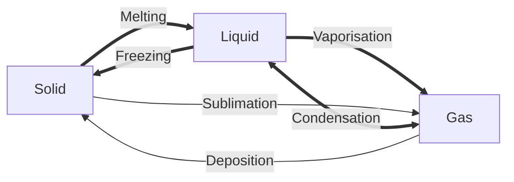

---
tags:
  - public
---
[[Thermodynamics MOC]]
# Phase change
Phase changes occur when [[Quantitative growth gives way to a qualitative leap]].
The various phase changes are shown below

Phase changes occur at specific combinations of [[Temperature]] and [[Pressure]], 
which can be shown in [phase diagrams](#Diagrams).
The energy required to complete a phase change for a given mass,
at a given temperature and pressure,
is the [[Heat of transformation]].

## Diagrams
![[Phase-diagram.svg]]
For $p > p_\text{cr}$ and $T > T_\text{cr}$, the distinction between liquid and gas break down,
giving way to a [[Supercritical fluid]].

![[water phase diagram.png#invert]]
Water is a strange case, increasing pressure on a solid changes it to a liquid.

---
#state/tidy | #SemBr | #lang/en
