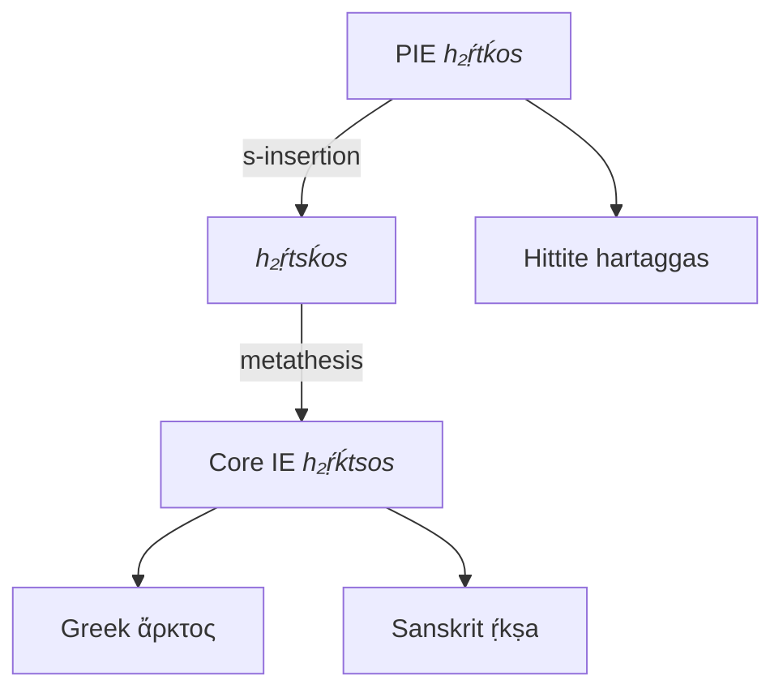
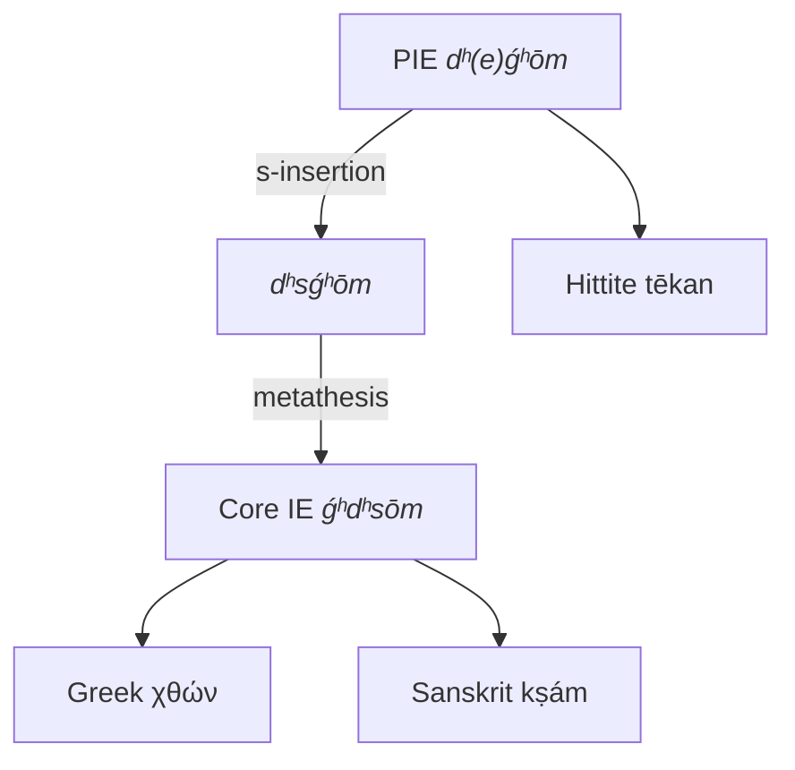

---
aliases:
  - þ-cluster
tags:
  - public
---
[[PIE phonology MOC]]
# Thorn clusters
The development of so-called **thorn clusters** or **þ-clusters** is a major problem in PIE phonology.
The root of the issue is Sanskrit and Greek evidence three-way phonemic contrast in the PIE context `K_`
that occurred nowhere else in the proto-language.[^2017]

1. Typically, in this position a Sanskrit <em class="ling">/S/</em> reflects a Greek <em class="ling">σ</em>
   - Sanskrit <em class="ling">dakṣiṇas</em> ”right hand” ≈ Greek <em class="ling">δεξῐός</em> (< PIE <em class="recon">deḱsi-</em>)
1. Likewise typically a Sanskrit <em class="ling">/T/</em> reflects a Greek <em class="ling">τ</em> or <em class="ling">θ</em>
   - Sanskrit <em class="ling">aṣṭáu</em> ”eight” ≈ Greek <em class="ling">ὀκτώ</em> (< PIE <em class="recon">oḱtṓw</em>)
2. However, there is a group of words with a sibilant <em class="ling">/S/</em> in Sanskrit
   and a coronal <em class="ling">τ</em> or <em class="ling">θ</em> in Greek
   - Sanskrit <em class="ling">ṛ́kṣa</em> ”bear” ≈ Greek <em class="ling">ἄρκτος</em>
   - Sanskrit <em class="ling">kṣám</em> ”ground” ≈ Greek <em class="ling">χθών</em>

The problem of þ-clusters arises from the need to explain this phenomenon.

[^2017]: 2017\. [[Sources/@ringeProtoIndoEuropeanProtoGermanic2017|From Proto-Indo-European to Proto-Germanic]], pp. 20–22

## Brugmann
Before the discovery of the older branches of Anatolian and Tocharian,
Brugmann explained this third class of words by introducing a new interdental phoneme <em class="recon">þ</em> (“thorn”)
which was contrastive to both <em class="recon">t</em> and <em class="recon">s</em> after dorsals only.

- PIE <em class="recon">ṛ́ḱþos</em> ”bear” > Sanskrit <em class="ling">ṛ́kṣa</em>, Greek <em class="ling">ἄρκτος</em>
- PIE <em class="recon">gʰþem</em> ”ground” > Sanskrit <em class="ling">kṣám</em>, Greek <em class="ling">χθών</em>

It is this hypothesis that gives the problem its name,
and indeed even linguists who do not necessarily accept the hypothesis may use <em class="recon">þ</em> to represent the unknown segment.

This hypothesis shares similarities with the now accepted [[PIE Laryngeal Theory]].

## Merlingen
The discovery of the more archaic Anatolian branch lead to a new hypothesis.
Notably the Hittite forms <em class="ling">hartaggas</em> and <em class="ling">tēkan</em> suggest PIE <em class="recon">h₂ṛ́tḱos</em> and <em class="recon">dʰ(e)ǵʰōm</em> respectively.
As accepted by Ringe[^2017], þ-clusters in the later stage of PIE[^core] remained underlyingly <em class="recon">KTs</em> which is explained by [[PIE *s insertion|*/s/ insertion]] followed by [[metathesis]],
so that <em class="recon">TK</em> > <em class="recon">TsK</em> > <em class="recon">KTs</em>. 
The metathesis, and possibly the s-insertion, did not occur in either Anatolian or Tocharian.
For example

[^core]: Ringe calls this “Core IE”.




%%
```txt
             s-insertion            metathesis
PIE h₂ṛ́tḱos ------------> h₂ṛ́tsḱos ------------> Core IE h₂ṛ́ḱtsos
       |                                                   /\
       |                                                  /  \
       v                                                 /    \
Hitt hartaggas                                          v      v
                                             Sanskrit ṛ́kṣa    Greek ἄρκτος
```
%%



%%
```txt
               s-insertion           metathesis
PIE dʰ(e)ǵʰōm ------------> dʰsǵʰōm ------------> Core IE ǵʰdʰsōm
       |                                                   /\
       |                                                  /  \
       v                                                 /    \
Hitt tēkan                                              v      v
                                             Sanskrit kṣám    Greek χθών
```
%%

#
---
#state/tidy | #lang/en | #SemBr
